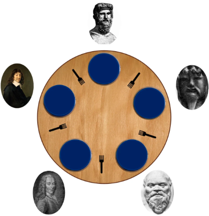
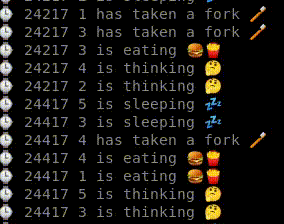

# philosophers

## Introduction

*I never thought philosophy would be so deadly*

## Objectives

In this project, you will learn the basics of threading a process.
You will see how to create threads and you will discover mutexes.

--------
LinkedIn: https://www.linkedin.com/in/pedrosmpm
